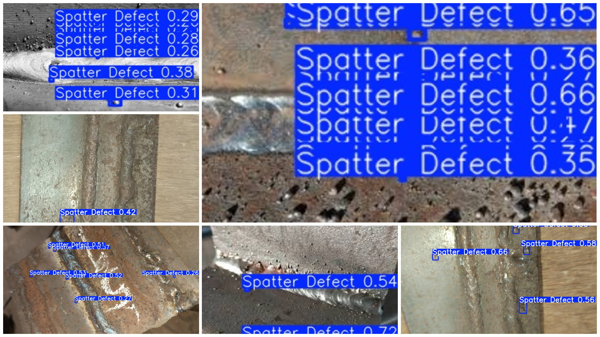

# Real-Time Manufacturing Defect Detecting System (RT-MDDS)

## 📌 Project Overview
The **Real-Time Manufacturing Defect Detecting System** is an AI-driven Quality Assurance (QA) solution designed for automated production environments. This prototype leverages deep learning to identify welding spatter defects in real-time, aiming to reduce manual inspection time and material waste in smart factories.

Developed by a **Mechanical Engineering** student at **GECT**, this project serves as a core competency showcase for **Industry 5.0** applications.

## 📸 Prototype Results
The model successfully identifies spatter clusters across varied metal surfaces and lighting conditions. Below is a summary of the Phase 1 testing results, showcasing successful detections on industrial weld samples.

> **Key Performance Metric:** Achieved confidence scores as high as **0.83** during initial validation. Detailed individual samples can be found in the `/test-results` directory.

## 🛠️ Technical Workflow
* **Dataset Management:** Annotated and partitioned via **Roboflow**.
* **Architecture:** Trained on the **YOLO** (You Only Look Once) framework for high-speed, real-time inference.
* **Deployment Ready:** Weights are exported in **.onnx** format for optimized execution on industrial edge devices and cross-platform compatibility.

## 🧪 Current Status & Roadmap
This repository documents **Phase 1** (Proof of Concept).
- [x] **Phase 1:** Initial validation on a 35-image curated dataset.
- [ ] **Phase 2:** Scaling to a **100-200 image dataset** to improve environmental robustness.
- [ ] **Phase 3:** Integration with hardware triggers (e.g., automated rejection signals via PLC or Microcontrollers).

## 📂 Project Structure
* `/weights`: Contains `best.pt` and `best.onnx`.
* `/test-results`: Full-resolution individual inference outputs showing confidence scores.
* `/V1`: Standard YOLO dataset structure (train/test/val).
* `/assets`: Visuals and collages used in this documentation.

## 👨‍💻 Author
**Karthik** *2nd Year B.Tech Mechanical Engineering, Govt. Engineering College, Thrissur (GECT)*  
*Specialization: Industry 5.0 | Robotics | AI-Driven Manufacturing*
